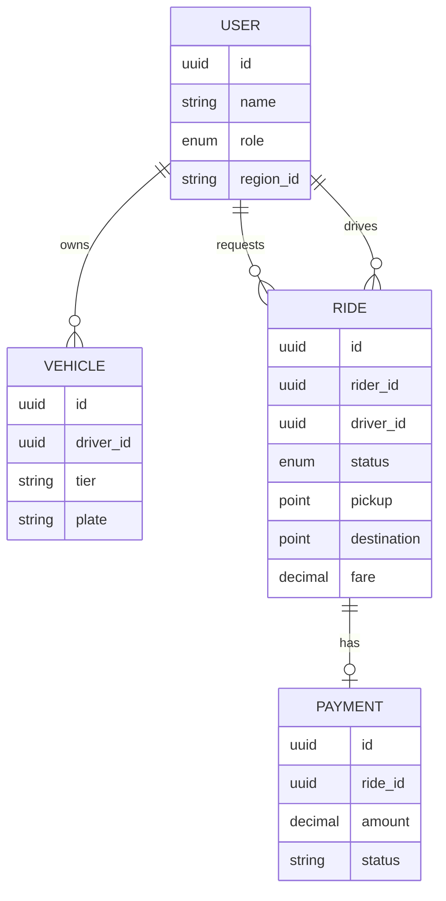

# Data Model & ERD

## 1. Core Entities

### 1.1 User Table
| Field | Type | Description |
| :--- | :--- | :--- |
| `id` | UUID | Primary Key |
| `name` | String | |
| `role` | Enum | RIDER, DRIVER |
| `region_id` | String | Geolocation affinity |

### 1.2 Ride Table
| Field | Type | Description |
| :--- | :--- | :--- |
| `id` | UUID | Primary Key |
| `rider_id` | UUID | FK to Users |
| `driver_id` | UUID | FK to Users |
| `status` | Enum | REQUESTED, MATCHED, STARTED, etc. |
| `pickup` | Point | Start coordinate |
| `destination` | Point | End coordinate |
| `fare` | Decimal | Final calculated fare |

### 1.3 Vehicle Table
| Field | Type | Description |
| :--- | :--- | :--- |
| `id` | UUID | Primary Key |
| `driver_id` | UUID | FK to Users |
| `tier` | String | MINI, SEDAN, PREMIUM, etc. |
| `plate` | String | Vehicle license plate |

### 1.4 Payment Table
| Field | Type | Description |
| :--- | :--- | :--- |
| `id` | UUID | Primary Key |
| `ride_id` | UUID | FK to Rides |
| `amount` | Decimal | Total amount paid |
| `status` | String | PENDING, SUCCESS, FAILED |
