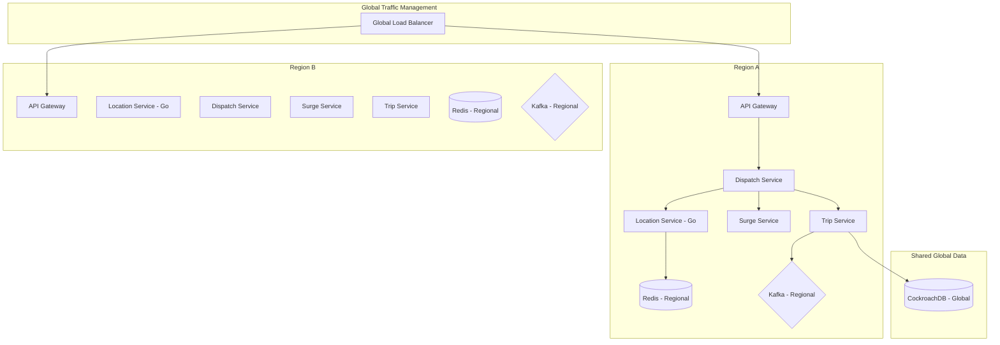

# High-Level Design: Multi-Region Ride-Hailing Platform

## 1. Architecture Overview
The system follows a multi-region, microservices-based architecture designed for high availability, low latency and global scale.

### Key Components

#### 1.1 Driver Location Service
- **Responsibility**: Ingest 500k location updates/sec globally.
- **Tech Stack**: Go-based high-throughput ingestion (using goroutines/channels), Redis (Geo-indexing).
- **Strategy**: Location updates are stored in regional Redis clusters using H3 spatial indexing.

#### 1.2 Surge Pricing Service
- **Responsibility**: Calculate multipliers based on supply/demand.
- **Logic**: Aggregates driver density and rider demand per geo-cell.

#### 1.3 Dispatch Service
- **Responsibility**: Assign best driver to rider in <1s.
- **Algorithm**: Ranked matching based on ETA, Rating, and Vehicle Tier.

#### 1.4 Trip Service
- **Responsibility**: Manage lifecycle (Requested -> Accepted -> Started -> Compeleted).
- **Consistency**: **Global CockroachDB Cluster** for transactional integrity.
- **Data Locality**: Uses **Geo-partitioning** to pin data to the local region (low-latency writes) while remaining part of a single, unified global cluster (high availability and global reads).

## 2. Data Flow
1. **Rider Request**: Rider -> API Gateway -> Dispatch Service.
2. **Matching**: Dispatch Service calls Surge Service (get multiplier) -> Queries Location Service (find drivers) -> Ranks drivers -> Notifies Driver (WebSocket/Push).
3. **Acceptance**: Driver accepts -> Trip Service initializes trip -> Notifies Rider (WebSocket/Push).

## 3. Storage Strategy
- **Redis**: Driver locations and session data.
- **CockroachDB**: User profiles, trip data and global state.
- **Kafka**: Asynchronous events (Notifications, Payments, Analytics etc).
