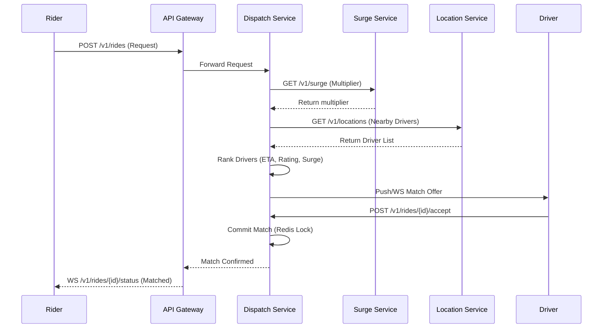

# Low-Level Design: Dispatch & Matching Service

## 1. Goal
Assign the most suitable driver to a rider request within **<1s (p95)** while preventing race conditions.

## 2. Core Logic

### 2.1 Spatial Indexing (H3)
- Use **H3 level 7/8** for grouping drivers.
- Redis Sorted Sets for low-latency geo-queries.

### 2.2 Ranking Algorithm
The Dispatch Service first fetches the current **Surge Multiplier** from the Surge Service to calculate the final price.
The ranking score is then calculated as:
$$Score = w_1 \cdot ETA + w_2 \cdot Rating + w_3 \cdot Tier$$
- Configurable weights via feature flags.

### 2.3 Concurrency Control
- **Redis Distributed Locks**: `lock:driver:{id}` to ensure a driver is only matched to one ride at a time.
- **Idempotency**: `request_id` tracking at the API Gateway and Service level.

## 3. Handling Timeouts
- 10s driver acceptance window.
- Automatic re-ranking and failover to the next best driver.
